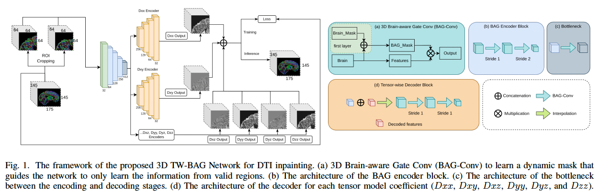

# TW-BAG

This repository contains the official implementation of the following paper:

> **TW-BAG: Inpainting Disrupted Diffusion Tensor Imaging Using Tensor-wise Brain-aware Gate Network**
>
> 
[Zihao Tang](https://scholar.google.com.au/citations?user=JAfD8moAAAAJ&hl=en&oi=sra), 
[Xinyi Wang](https://scholar.google.com/citations?user=_uPPBqUAAAAJ&hl=en),
Lihaowen Zhu, 
[Mariano Cabezas](https://scholar.google.com.au/citations?user=zPs-kAkAAAAJ&hl=en&oi=sra),
[Dongnan Liu](https://scholar.google.com.au/citations?user=JZzb8XUAAAAJ&hl=en&oi=sra),
[Michael Barnett](https://scholar.google.com.au/citations?user=iZVWDzwAAAAJ&hl=en),
[Weidong Cai](https://weidong-tom-cai.github.io),
[Chenyu Wang](https://scholar.google.com.au/citations?user=mo0AoZAAAAAJ&hl=en)
>

> [DICTA 2022](http://dicta2022.dictaconference.org)

>
> **Abstract** Diffusion Weighted Imaging (DWI) is an advanced imaging technique commonly used in neuroscience and neurological clinical research through a Diffusion Tensor Imaging (DTI) model. Volumetric scalar metrics including fractional anisotropy, mean diffusivity, and axial diffusivity can be derived from the DTI model to summarise water diffusivity and other quantitative microstructural information for clinical studies. However,  clinical practice constraints can lead to sub-optimal DWI acquisitions with missing slices (either due to a limited field of view or the acquisition of disrupted slices). To avoid discarding valuable subjects for group-wise studies, we propose a novel 3D Tensor-Wise Brain-Aware Gate network (TW-BAG) for inpainting disrupted DTIs. The proposed method is tailored to the problem with a dynamic gate mechanism and independent tensor-wise decoders. We evaluated the proposed method on the publicly available Human Connectome Project (HCP) dataset using common image similarity metrics derived from the predicted tensors and scalar DTI metrics. Our experimental results show that the proposed approach can reconstruct the original brain DTI volume and recover relevant clinical imaging information.
>

> [[Project page]]() [[Arxiv]](https://arxiv.org/abs/2210.17076)

<!--  -->


## Dataset

The sample is named following input: ```sub + "_tensor.nii.gz"```;  gt: ```sub + "_tensor.nii.gz"```; mask: ```sub + "_brain_mask.nii.gz"```; e.g., input path: ```os.path.join(img_path, sub + "_tensor.nii.gz")``` and sub: ```105620```.


## Basic Usages

**Basic Flags**
- ```--img_path```: path of DTI inputs.
- ```--gt_path```: path of DTI gts.
- ```--mask_path```: path of masks.
- ```--save_axial```: proportion of saved axial slices.
- ```--phase validation```: validation / training.

**Training**
```
sh train_hcp_dti_twbag_0.445.sh
```

**Evaluation**
```
sh test_hcp_dti_twbag_0.445.sh
```

## Citation

If you find our data or project useful in your research, please cite:

```
TBC

@inproceedings{
}
```
#### Acknowledgments
This repo. template was borrowed from [Chaoyi Zhang's Project](https://github.com/chaoyivision/SGGpoint). 

